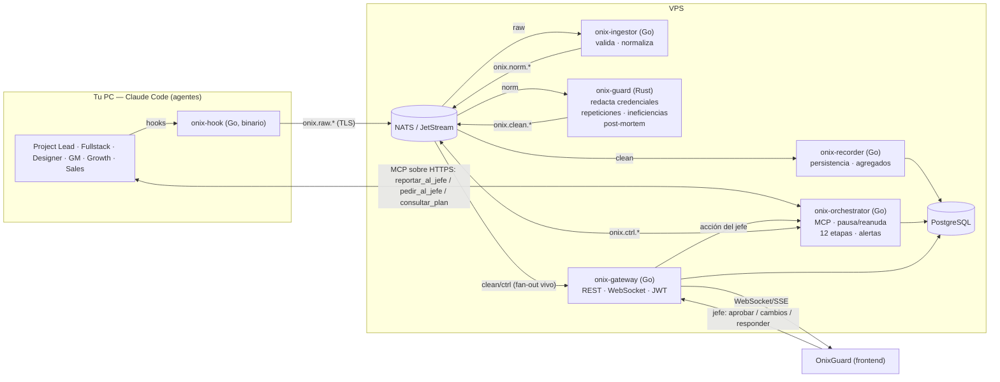
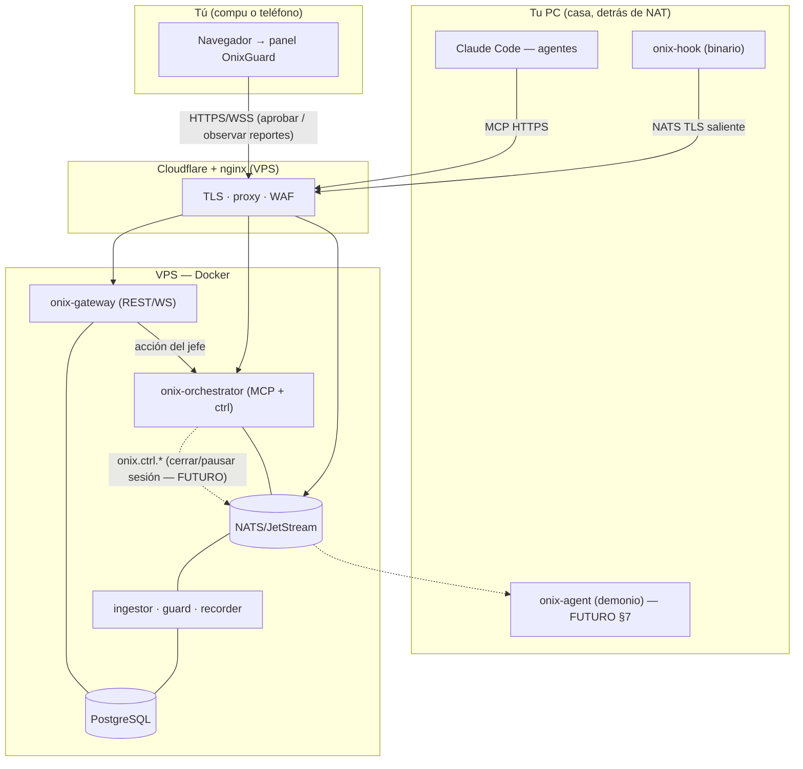

# OnixGuard — Plan de construcción

> App web para **monitorear y controlar en tiempo real** un equipo de agentes de Claude Code, y **estudiar** su desempeño (errores, repeticiones, ineficiencias) para decidir si el trabajo multiagente vale la pena y mejorar las skills.
>
> **Estado:** plan para aprobación. **No se escribe código todavía.** Al final: resumen + preguntas abiertas (§13). *(El logo Oni lo diseña el jefe; aquí solo se reserva `public/logo.svg`.)*
>
> Plan redactado aplicando los roles del equipo: **General Manager, Project Lead, Full-Stack, Designer y QA.** (Growth/Sales/Conversion-Copy son **roles que la herramienta observa**, no funciones de construcción de OnixGuard — ver §12.)

---

## 0. General Manager — encuadre y decisión

- **Objetivo doble:** (1) *operar* el equipo (ver, responder, aprobar) y (2) *estudiar* (medir para saber si multiagente conviene y afinar skills).
- **Reutiliza activos:** VPS, Docker y CI/CD ya existentes → costo marginal bajo. **Se despliega en el mismo VPS.** (Sin n8n: se elimina de la arquitectura.)
- **Topología:** los **agentes corren en tu PC**; los **servicios corren en el VPS**. El plan incluye el diagrama de cómo tu PC se conecta al VPS (§1B) y deja la base para **cerrar/pausar sesiones desde el panel** (se agrega después, §7).
- **Arquitectura:** **microservicios en polyrepo** (un repo por servicio), no monorepo. **4 servicios en Go** + **`onix-guard` en Rust**; se comunican por NATS. Cada servicio se construye y despliega por separado (permite repartir el trabajo entre varios agentes en paralelo).
- **Riesgo principal:** sobre-ingeniería. Regla: **primero un vertical mínimo de punta a punta** (1 agente → hook → NATS → recorder → Postgres → lista en vivo) y recién después separar todos los servicios, la oficina pixel y `onix-guard` en Rust.
- **Criterio de éxito del proyecto:** poder responder con datos "¿el equipo multiagente produjo más valor del que costó?" al cerrar las 12 etapas.

---

## 1. Arquitectura (microservicios)

**5 microservicios** (4 en Go + 1 en Rust), cada uno en **su propio repo** y desplegable por separado. Se comunican de forma asíncrona por **NATS/JetStream** (las únicas llamadas directas son gateway↔Postgres y orchestrator↔Postgres). Fuera de esa lista: `onix-hook` (binario CLI en tu PC), el frontend (repo `OnixGuard`) y la infraestructura (NATS, Postgres).

### Microservicios y su responsabilidad
| # | Servicio (repo) | Lenguaje | Responsabilidad | Entrada → Salida |
|---|---|---|---|---|
| 1 | **onix-ingestor** | Go | Punto de entrada de la telemetría: consume `onix.raw.*`, **valida y normaliza** el evento (params, timestamps, rol/sesión). No persiste ni analiza. | NATS `raw` → NATS `norm` |
| 2 | **onix-guard** | **Rust** | Seguridad + análisis: **redacta credenciales (SHA-256)**, **marca repeticiones e ineficiencias**, genera el **post-mortem** al cerrar etapas. El único que ve el valor crudo, y lo destruye. | NATS `norm` → NATS `clean` |
| 3 | **onix-recorder** | Go | Persistencia: consume `onix.clean.*` y escribe en **PostgreSQL** (inserts por lote). También materializa métricas/agregados. | NATS `clean` → Postgres |
| 4 | **onix-orchestrator** | Go | Plano de control: **servidor MCP** (`reportar_al_jefe`/`pedir_al_jefe`/`consultar_plan`), **pausa/reanudación** de agentes, flujo de **12 etapas**, **alertas**, y (futuro) el canal de **control remoto de la PC**. | MCP + NATS `ctrl` |
| 5 | **onix-gateway** | Go | Edge público que consume el frontend: **REST + WebSocket + auth JWT**. Lee de Postgres y se suscribe a NATS para empujar el vivo. No tiene lógica de negocio pesada. | HTTP/WS ↔ frontend |

### Componentes que **no** son microservicios
| Componente | Lenguaje | Responsabilidad |
|---|---|---|
| **onix-hook** | Go (binario) | Corre **en tu PC**; lo ejecutan los hooks de Claude Code. Arma el evento crudo y lo publica en `onix.raw.<sesión>` (conexión saliente al VPS). Sin lógica pesada; no bloquea al agente. Repo propio. |
| **OnixGuard** (frontend) | React (Vite+TS+Tailwind+shadcn/ui) | El **repo existente `OnixGuard`** = las 3 pantallas (Monitoreo, Reportes, Logs), en vivo por WebSocket. |
| **NATS + JetStream** | — | Bus de eventos durable en el VPS (streams `ONIX_RAW`, `ONIX_NORM`, `ONIX_CLEAN`, `ONIX_CTRL`). |
| **PostgreSQL** | — | Almacenamiento (lo monta el jefe en el VPS; se entrega esquema + migraciones + `DATABASE_URL`). |

> **Nomenclatura:** todos los repos de servicio llevan prefijo **`onix-`** (con i); el frontend es el repo existente **`OnixGuard`**. La marca en la UI puede mostrarse como prefieras (Onix/Onix) — te lo dejo a confirmar, pero no bloquea nada.

> **Nota de arquitecto (evitar sobre-ingeniería):** para el **MVP** `onix-ingestor` + `onix-recorder` pueden ser un solo servicio y arrancar **sin `onix-guard`** (Fase 1). Se separan cuando el vertical mínimo ya funciona; así cada agente construye un servicio en paralelo.

### Diagrama de flujo (Mermaid)


**Validación del flujo:** correcto y bien separado. Tres notas:
1. **Pausa/reanudación por MCP (no por hooks):** un agente se "pausa" porque llama a `reportar_al_jefe`/`pedir_al_jefe` en **onix-orchestrator** y **esa llamada MCP no retorna hasta que el jefe responde** (bloqueo natural, sin matar el proceso).
2. **Acción del jefe:** el frontend pega en **onix-gateway** (REST), que reenvía a **onix-orchestrator**; este publica en `onix.ctrl.<sesión>` y **retorna** la respuesta a la llamada MCP pendiente.
3. **Contrato compartido:** los esquemas de eventos (raw/norm/clean) y de la API viven en el repo **`onix-contracts`** (paquete Go + crate Rust), que todos los servicios importan, para que Go y Rust no se desincronicen.

---

## 1B. Topología de despliegue y conexión con tu PC

**Dos lados:** tu **PC** (donde corren Claude Code y los agentes) y el **VPS** (donde corren los 5 servicios + NATS + Postgres + frontend). La regla de oro: **tu PC siempre inicia la conexión hacia el VPS** (salientes), así **no hay que abrir puertos en tu PC** ni exponerla a internet (funciona detrás del router/NAT de casa).

### Qué se instala en cada lado
- **En tu PC:** el binario **`onix-hook`** (lo llaman los hooks de Claude Code) y, a futuro, un pequeño demonio **`onix-agent`** (para cerrar/pausar sesiones a distancia desde el panel — §7). Ambos abren una **conexión saliente TLS a NATS** en el VPS y se autentican con un token de máquina.
- **En el VPS:** NATS/JetStream, `onix-ingestor`, `onix-guard`, `onix-recorder`, `onix-orchestrator`, `onix-gateway`, PostgreSQL y el frontend `OnixGuard`, todo tras **nginx + Cloudflare** (mismo esquema que devtoolsdk.com), en el subdominio propuesto `onix.devtoolsdk.com`.

### Cómo se conecta cada canal
- **Telemetría (hooks):** `onix-hook` → **NATS (TLS, puerto saliente)** → servicios. No requiere HTTP.
- **MCP (agentes ↔ jefe):** Claude Code en tu PC se conecta al **servidor MCP de `onix-orchestrator` por HTTPS remoto** (transport SSE/HTTP), autenticado. Aquí viajan `reportar_al_jefe` / `pedir_al_jefe` / `consultar_plan`.
- **Panel (tú):** navegador — en la compu **o en el teléfono** — → **`onix-gateway` (HTTPS + WebSocket)** vía Cloudflare. Aquí ves el vivo y **respondes los reportes** (apruebas / haces observaciones), que vuelven a cada agente.

### Diagrama de despliegue (Mermaid)


---

## 2. Repos (polyrepo) y Docker Compose

**Un repo por servicio** (polyrepo), no monorepo. Cada repo trae su `Dockerfile`, sus tests y su CI propio.

```text
onix-contracts/     # Esquemas compartidos (JSON Schema) de eventos raw/norm/clean + REST/WS/MCP.
                    #   Publicado como paquete Go y crate Rust; fuente única de verdad de los contratos.
onix-hook/          # Go — binario que corre en tu PC, en los hooks de Claude Code (publica onix.raw.*).
onix-ingestor/      # Go — valida y normaliza (raw → norm).
onix-guard/         # Rust — redacción SHA-256, detección, post-mortem (norm → clean).
onix-recorder/      # Go — persistencia en Postgres + agregados (clean → DB).
onix-orchestrator/  # Go — MCP, pausa/reanuda, 12 etapas, alertas, canal de control remoto.
onix-gateway/       # Go — REST + WebSocket + JWT (lo consume el frontend).
OnixGuard/          # (REPO EXISTENTE) Frontend: Vite + React + TS + Tailwind + shadcn/ui.
                    #   public/logo.svg  → RESERVADO, lo diseña el jefe (no crear).
onix-db/            # migrations/ (0001_init.sql, ...) + schema.sql (referencia).
onix-deploy/        # docker-compose.yml (dev), infra del VPS, CI/CD de despliegue, .env.example.
```

Estructura interna típica de un servicio Go: `cmd/<svc>/main.go`, `internal/` (handlers, nats, store), `Dockerfile`, `.github/workflows/ci.yml`. El de Rust (`onix-guard`): `src/`, `Cargo.toml`, `Dockerfile`.

**Levantar en local (`onix-deploy/docker-compose.yml`):** orquesta `nats` (JetStream) + los 5 servicios + el frontend `OnixGuard` para desarrollo integrado (cada uno construido desde su repo o imagen). **PostgreSQL es externo** → `DATABASE_URL` por variable de entorno; el compose no lo levanta. `onix-hook` **no** va en el compose: se compila (`go build`) y se instala **en tu PC**; su config apunta a `NATS_URL` (TLS, saliente al VPS). Un `make dev` en `onix-deploy` levanta todo y aplica migraciones desde `onix-db`.

> **Coordinación de repos:** para no perder de vista el conjunto, **`onix-deploy`** incluye un README-índice y (opcional) submódulos o un manifiesto con las URLs/versiones de cada repo. Docker Compose junta todo en desarrollo; en producción cada servicio despliega por CI/CD a su contenedor en el VPS.

---

## 3. Esquema PostgreSQL

Tablas (columnas clave; todo `id` = uuid; timestamps `timestamptz`):

- **projects**(id, name, status, created_at)
- **stages**(id, project_id→projects, number 1..12, name, status[`pendiente|activa|hecha`], started_at, ended_at) — el plan de 12 etapas.
- **agents**(id, project_id, role[`project_lead|fullstack|designer|growth|sales|gm`], display_name, avatar_key, created_at) — 1 por skill; **auto-registrado**.
- **sessions**(id, agent_id→agents, project_id, claude_session_id UNIQUE, status[`activa|pausada|cerrada`], started_at, ended_at) — auto-registrado en SessionStart.
- **events**(id, session_id, agent_id, stage_id, ts, type[`tool|error|repeticion|credencial|tarea|reporte|nota`], tool, summary, duration_ms, tokens, cost_usd, is_error, is_repetition) — **denormaliza agent_id y stage_id** para filtros rápidos de Logs.
- **tool_calls**(id, event_id→events, tool, params_normalized jsonb, params_hash, exit_code, duration_ms) — detalle para la regla de repetición.
- **alerts**(id, session_id, stage_id, type[`error|repeticion|ineficiencia`], severity, message, ts, resolved bool)
- **credentials_detected**(id, event_id, kind[`api_key|token|password|conn_string|env`], sha256, label, ts) — **solo el hash**, jamás el valor.
- **reports**(id, project_id, stage_id, agent_id, title, status[`espera|aprobado|cambios|respondido`], summary, deliverables jsonb, decisions jsonb, tokens, cost_usd, errors, repetitions, created_at)
- **messages**(id, report_id→reports, sender[`jefe|agente`], body, created_at) — el chat de la pantalla Reportes.
- **exports**(id, project_id, scope[`todas|etapa_actual`], format[`jsonl|csv`], path, created_at)

**Índices (para los filtros de Logs y el vivo):**
`events(project_id, ts desc)`, `events(agent_id, ts desc)`, `events(stage_id, ts desc)`, `events(type, ts desc)`, `events(tool)`, `tool_calls(params_hash)`, `credentials_detected(sha256)`, `reports(status, created_at desc)`.

Migraciones versionadas en el repo `onix-db` (`migrations/`, aplicables con `migrate`/`goose`); `schema.sql` como referencia consolidada.

---

## 4. Contratos (NATS · REST · WebSocket · MCP)

### NATS subjects
- `onix.raw.<claude_session_id>` — evento crudo (publica `onix-hook`; consume `onix-ingestor`).
- `onix.norm.<claude_session_id>` — evento validado/normalizado (publica `onix-ingestor`; consume `onix-guard`).
- `onix.clean.<claude_session_id>` — evento limpio/enriquecido y sin credenciales (publica `onix-guard`; consumen `onix-recorder` y `onix-gateway`).
- `onix.ctrl.<claude_session_id>` — control jefe→agente (publica `onix-orchestrator`).
- Streams JetStream: `ONIX_RAW`, `ONIX_NORM`, `ONIX_CLEAN`, `ONIX_CTRL` (retención por tiempo/tamaño configurable).

**Formato de evento (raw):**
```json
{ "v":1, "session":"<claude_session_id>", "agent_role":"fullstack",
  "hook":"PostToolUse", "ts":"2026-09-27T14:41:05Z", "tool":"Bash",
  "params":{"command":"npm run test"}, "result":{"exit_code":1,"duration_ms":4200},
  "tokens":860, "cost_usd":0.0, "cwd":"/repo", "project":"onixguard", "stage":3 }
```
**Evento clean** = raw + `{ "params_hash":"…", "params_normalized":{…}, "is_error":true, "is_repetition":false, "credentials":[{"kind":"conn_string","sha256":"9f2c…e41a","label":"[credencial · sha256:9f2c…e41a]"}] }` (con el valor real ya removido).

### REST (onix-gateway)
`POST /auth/login` · `GET /api/overview` (métricas del header) · `GET /api/agents` · `GET /api/stages` · `GET /api/events?agent=&stage=&type=&q=&limit=&cursor=` · `GET /api/events/{id}` · `GET /api/reports` · `GET /api/reports/{id}` · `POST /api/reports/{id}/respond {action:aprobar|cambios|responder, message}` (el gateway reenvía a `onix-orchestrator`) · `POST /api/export {scope,format}` · `GET /healthz`.

### WebSocket (`/ws`, en onix-gateway)
Mensajes `{type, data}` con `type ∈ { event, metrics, agent_status, report, alert, stage }`. El cliente se suscribe al proyecto y recibe el vivo (lista de actividad, tarjetas de agente, oficina, contadores).

### MCP (servidor expuesto por onix-orchestrator para los agentes)
- `reportar_al_jefe(stage, summary, deliverables[], decisions[])` → crea el reporte, marca la sesión `pausada` y **no retorna** hasta que el jefe responde; devuelve `{action, message}`.
- `pedir_al_jefe(question)` → igual patrón bloqueante; devuelve `{message}`.
- `consultar_plan()` → devuelve el plan de 12 etapas y la etapa actual.

---

## 5. Hooks de Claude Code e identificación de agentes

**Hooks** (en `.claude/settings.json` de cada agente) que ejecutan `onix-hook` pasándole el payload por stdin:
`SessionStart`, `PreToolUse`, `PostToolUse`, `Stop`, `SubagentStop`, `Notification`.

**Identificación automática (sin registro manual):**
- Al lanzar cada sesión-agente se define `ONIX_AGENT_ROLE` (p. ej. `fullstack`) y `ONIX_PROJECT`. En `SessionStart`, `onix-hook` publica un evento `session_start` con `role` + `claude_session_id`; `onix-recorder` **crea/actualiza** el `agent` y la `session` solos.
- Fallback si no hay env: `onix-hook` infiere el rol de la **skill activa** (nombre de skill → rol) desde el contexto del hook.
- Config de NATS (`NATS_URL`) y `ONIX_PROJECT` van por variable de entorno del hook.

---

## 6. Flujo: reunión → 12 etapas → reporte → pausa → respuesta

1. **Reunión inicial:** se lanzan los agentes con las skills necesarias; el jefe pasa el contexto; el **General Manager/Project Lead** produce el **plan de 12 etapas** y lo envían como reporte `Plan de 12 etapas` → el jefe **aprueba** en la web.
2. **Durante una etapa:** los agentes trabajan; cada tool call fluye por hooks→NATS→ingestor→guard→recorder→gateway→web (vivo). El **Project Lead coordina** (Task→otros agentes).
3. **Cierre de etapa:** el Project Lead llama `reportar_al_jefe(...)` → se crea el reporte, **su sesión (y las que dependan) quedan `pausada`**, y la llamada MCP **queda esperando**.
4. **Respuesta del jefe:** desde **Reportes**, el jefe **Aprueba / Pide cambios / Responde** (gateway → orchestrator). `onix-orchestrator` publica en `onix.ctrl.<sesión>` y **retorna** la respuesta a la llamada MCP pendiente → el/los agentes **reanudan**.
5. **Petición a mitad de etapa:** cualquier agente puede llamar `pedir_al_jefe(...)` → mismo patrón (pausa hasta respuesta).

**Pausar/reanudar = bloqueo de la llamada MCP** (con timeout configurable y persistencia del estado en `sessions.status`), no se mata el proceso del agente.

---

## 7. Interacción con los agentes y control de sesiones (todo desde el panel)

**Sin Telegram ni bots.** Toda tu interacción es por el **panel web `OnixGuard`**, que también abres desde el teléfono en el navegador.

**Aprobar / observar reportes (MVP, es el flujo principal):**
- Cuando un agente termina una etapa (o necesita algo) llama a `reportar_al_jefe(...)` / `pedir_al_jefe(...)` → **se crea el reporte y ese agente queda en pausa esperando**.
- En el **apartado de Reportes** ves el reporte; tú **apruebas** o escribes **observaciones**.
- Tu respuesta viaja gateway → orchestrator → `onix.ctrl.<sesión>` y **vuelve a ese mismo agente** (retorna su llamada MCP pendiente), que continúa con tus indicaciones. Cada respuesta va dirigida **al agente que creó el reporte**.

**Control remoto de sesiones (FUTURO, no MVP):** poder **cerrar/pausar** una sesión de Claude Code en tu PC desde el panel (p. ej. "se me olvidó cerrar tal sesión, ciérrala"). Requiere el demonio **`onix-agent`** en tu PC:
- Mantiene una **conexión saliente TLS a NATS** (igual que `onix-hook`, sin abrir puertos en tu PC) y se suscribe a `onix.ctrl.<host>`.
- Ejecuta solo **acciones de lista blanca** (cerrar/pausar/reanudar/listar sesiones); nunca comandos arbitrarios.
- Se dispara **desde el panel** (botón), no por chat externo. Toda acción queda **auditada** como evento en Postgres.

**Alertas:** error/repetición/etapa se ven en el **panel en vivo** (WebSocket). (Sin n8n ni notificaciones externas.)

---

## 8. Métricas del estudio multiagente + post-mortem

**Qué medir** (por etapa y por agente):
- Costo (USD) y tiempo por etapa; tokens por etapa vs. promedio.
- Errores y repeticiones por agente; ineficiencias detectadas.
- **Tiempo esperando al jefe** (suma de pausas) — cuánto frena la supervisión.
- **Retrabajo** (cambios pedidos tras un reporte; reintentos tras error).
- Nº de tareas delegadas y completadas por rol.

**Post-mortem (lo genera onix-guard):** al cerrar etapas, produce un informe agregado — costo/tiempo por etapa, ranking de errores/repeticiones por rol, cuellos de botella (tiempo en pausa), y una conclusión con evidencia sobre "si valió la pena". Se exporta (JSONL/CSV) para analizar y afinar skills.

**Reglas de detección (umbrales configurables, en tabla de config con override por env):**
- **Error:** tool falla o `exit_code != 0`.
- **Repetición:** mismo `tool` + `params_hash` **≥ 3 veces** en **ventana de 4 min** sin cambios de archivos entre medio.
- **Ineficiencia:** reintentar comando fallido sin cambios (**≥ 2**), leer el mismo archivo grande (**≥ 3** veces), **> N min** sin avance, o **tokens de etapa > 1.5×** la mediana. (`N`, ventanas y multiplicador → configurables.)

---

## 9. Seguridad

- **Redacción de secretos (onix-guard):** detecta API keys, tokens, contraseñas, cadenas de conexión y contenido de `.env`; **reemplaza el valor por `[credencial · sha256:…]` + tipo**. El valor real **nunca** se publica en `clean`, **nunca** se guarda en Postgres, **nunca** en logs ni exportaciones.
- **Panel:** login con JWT (access+refresh), contraseñas con **argon2**, rate-limit en `/auth/login`.
- **Conexión PC ↔ VPS:** NATS con **TLS + token de máquina**; tu PC solo abre conexiones **salientes** (sin puertos abiertos en casa). El MCP de `onix-orchestrator` se sirve por **HTTPS autenticado**, solo accesible por las sesiones autorizadas.
- **Control de sesiones (futuro §7):** `onix-agent` solo ejecuta comandos de **lista blanca** (cerrar/pausar/reanudar), disparados **desde el panel autenticado**, firmados y auditados. Sin canales externos (nada de Telegram).
- **Auth del panel:** **un solo usuario** por ahora (decisión tomada).
- **Nunca se registra:** valores de credenciales, contenido de `.env`, ni el chain-of-thought del agente (solo acciones/tools/resultados).

---

## 10. Designer — sistema visual (respeta el diseño aprobado)

**Tokens (exactos):** fondo `#1A1A1A`, tarjetas `#212121`, bordes `#2E2E2E`; texto `#EDEDED`/`#A0A0A0`; marca `#FF3B4E` (solo marca, botón principal y etapa activa). Estados (fondo/texto): trabajando `#1F3321`/`#7ACB7F`, error `#3A1E1E`/`#FF8080`, repetición `#2E2540`/`#C4A7FF`, esperando `#3A2F17`/`#F0C060`, inactivo `#2A2A2A`/`#BDBDBD`. Tipografía **Geist** (UI) + **Geist Mono** (horas, comandos, logs). Radios **16px** tarjetas / **10px** botones.

**Pantallas (según capturas):**
1. **Monitoreo** — fila de métricas (tools, tokens, costo, errores, repeticiones, etapa X/12), barra de 12 etapas (activa en `#FF3B4E`), **oficina pixel** con los agentes-gato, **lista de actividad en vivo** (derecha) y **tarjetas por agente** (abajo, con barra de progreso y chip de estado).
2. **Reportes** — bandeja izquierda (por agente/etapa, con estado), centro el reporte (métricas, resumen, entregables con su ruta, "Necesitan tu decisión"), derecha **chat** con "Aprobar etapa / Pedir cambios / Enviar respuesta".
3. **Logs** — buscador + filtros (agente/etapa/tipo con contadores), tabla de eventos (mono), panel de detalle (incluye la credencial como hash), y **Exportar para análisis** (JSONL/CSV, alcance todas/actual).

**Oficina pixel (propuesta técnica):** **canvas con spritesheet** (recomendado) — mejor rendimiento y animación para varios sprites que SVG/DOM. Un spritesheet por estado del gato (idle, tecleando, error, esperando); el estado del agente elige el set de frames y el **color del monitor**. Las **burbujas/etiquetas de acción** (`Bash ×`, `Read ×3`, `WebSearch`) van como **DOM absolutamente posicionado sobre el canvas** (texto nítido). Piso `#DDE7E2`, paredes `#F4F1EA`, madera `#B8803E`. Animar según eventos en vivo (llega `event`/`agent_status` por WS → cambia sprite/burbuja/monitor). Alternativa: PixiJS si se complica el manejo manual del canvas.

**Frontend:** **Vite + React + TS + Tailwind + shadcn/ui** (confirmado). Estado en vivo por **WebSocket** (fallback SSE). `public/logo.svg` **reservado** (no crear — máscara Oni la hace el jefe).

---

## 11. QA — pruebas (skill devtoolsdk-qa)
- **Contratos:** tests de esquema (desde `onix-contracts`) para eventos raw/norm/clean, REST y mensajes WS — que ningún servicio (Go o Rust) rompa el contrato. Es la red de seguridad clave en polyrepo.
- **onix-guard (Rust):** unit tests de **redacción de credenciales** (nunca filtra el valor) y de **detección** (repetición/ineficiencia con casos límite).
- **onix-recorder / onix-orchestrator / onix-gateway (Go):** tests de persistencia, métricas, **flujo MCP de pausa/respuesta**, y auth/WS del gateway.
- **E2E (Playwright):** login, Monitoreo en vivo (mock de WS), Reportes (aprobar/cambios), Logs (filtros + export). Regresión visual desktop.
- **Carga (k6):** ingestión de eventos (muchos tool calls/seg) y `/api/events` con filtros.
- **Gate en CI:** lint + unit + e2e; bloquea deploy si falla.

---

## 12. Roles Growth / Sales / Conversion-Copy
Para **construir** OnixGuard: **N/A** (herramienta interna). *Sí* aparecen como **agentes monitoreados** (la oficina y los reportes los incluyen). Solo entrarían como funciones si algún día OnixGuard se vuelve producto para terceros.

---

## 13. Fases de trabajo (empezar por lo mínimo de punta a punta)

- **Fase 0 — Cimientos:** crear los repos (`onix-contracts`, `onix-deploy`, `onix-db`), docker-compose de dev (NATS + un servicio "core" temporal + frontend `OnixGuard`), `.env.example`, migraciones base, plantilla de CI (lint/test/build) reutilizable por cada repo. *Aceptación:* `make dev` levanta todo; `/healthz` responde. *Prueba:* smoke local.
- **Fase 1 — Vertical mínimo E2E (lo primero):** `onix-hook` publica un evento real → NATS → un **servicio combinado ingestor+recorder** lo guarda en Postgres → `onix-gateway` lo empuja por WS → **lista de actividad en vivo** en la web (aún sin `onix-guard`; se consume `raw` directo). *Aceptación:* una acción de 1 agente aparece en la web en < 2s y queda en Postgres. *Prueba:* e2e con 1 agente real.
- **Fase 2 — Separar servicios + onix-guard (Rust):** dividir el servicio combinado en `onix-ingestor` y `onix-recorder`, e insertar `onix-guard` (norm→clean) con **redacción de credenciales** y **detección de repetición/error**; recorder pasa a consumir `clean`. *Aceptación:* una credencial jamás llega a Postgres (solo hash); una repetición se marca; los 3 servicios corren por separado. *Prueba:* unit (Rust) + e2e.
- **Fase 3 — onix-orchestrator: MCP + flujo de reporte/pausa/respuesta:** `reportar_al_jefe/pedir_al_jefe/consultar_plan`; pantalla **Reportes** con chat y aprobar/cambios (gateway → orchestrator). *Aceptación:* un agente se pausa al reportar y reanuda al responder el jefe. *Prueba:* e2e del ciclo.
- **Fase 4 — 12 etapas + métricas:** modelo de etapas, barra de progreso, métricas del header y por agente. *Aceptación:* avanzar de etapa refleja todo en Monitoreo.
- **Fase 5 — Logs + exportación:** pantalla Logs (filtros, detalle, credencial-hash) + export JSONL/CSV. *Aceptación:* filtros y export correctos con resumen por agente.
- **Fase 6 — Oficina pixel:** canvas + spritesheet, gatos animados por estado, burbujas. *Aceptación:* el estado en vivo mueve a los gatos/monitores.
- **Fase 7 — Control de sesiones (FUTURO, opcional):** demonio `onix-agent` en tu PC para **cerrar/pausar/reanudar sesiones desde el panel** (también accesible en el teléfono). *Aceptación:* un botón del panel cierra una sesión en tu PC y queda auditado. *(No es MVP; ver §7.)*
- **Fase 8 — Post-mortem + estudio:** onix-guard genera el informe agregado; export para afinar skills. *Aceptación:* informe con costo/tiempo/errores por etapa y conclusión.
- **Fase 9 — Seguridad y hardening:** auth panel, rate-limit, revisión de redacción, secretos en CI. *Aceptación:* checklist de §9 verde.
- **Fase 10 — Deploy:** cada servicio con su **CI/CD propio** → contenedor en el VPS detrás de nginx+Cloudflare (subdominio p. ej. `onix.devtoolsdk.com`); `onix-deploy` orquesta el conjunto. *Aceptación:* deploy automático de cada repo en push a su main.
- **Fase 11 — QA final + docs:** suite completa en verde, `docs/` al día. *Aceptación:* release listo.
- **Fase 12 — Cierre/estudio:** correr un proyecto real con el equipo, exportar todo, análisis multiagente. *Aceptación:* conclusión con datos sobre si valió la pena.

*(Las 12 fases de construcción son independientes de las "12 etapas" que el equipo de agentes ejecuta dentro de un proyecto monitoreado; coinciden en número por gusto, no por dependencia.)*

---

## 14. Riesgos y decisiones abiertas

**Riesgos:**
- **Complejidad de polyrepo** (5+ repos que deben mantenerse sincronizados). Mitiga: **`onix-contracts`** como fuente única de contratos + tests de contrato en CI; `onix-deploy` como índice y orquestador; empezar con servicios combinados (Fase 1) y separar después.
- **Rendimiento de ingestión:** muchos hooks/seg. Mitiga: onix-hook no bloquea (publica y sale), JetStream con back-pressure, batch de inserts en `onix-recorder`.
- **Detección con falsos positivos** (repetición/ineficiencia legítima). Mitiga: umbrales configurables + marcar, no bloquear.
- **Redacción incompleta de secretos** (formato raro). Mitiga: reglas por patrón + entropía; test exhaustivo; "fail-closed" (ante duda, redactar).
- **Pausa por MCP colgada** si el jefe no responde. Mitiga: timeout + reanudar/expirar, estado persistido.
- **Complejidad de la oficina pixel.** Mitiga: llega en Fase 6, después del valor real.

**Decisiones ya tomadas:**
- **Arquitectura:** microservicios en **polyrepo**, **4 servicios en Go + `onix-guard` en Rust**.
- **Sin n8n y sin Telegram/bots:** toda la interacción es por el **panel web** (§7).
- **Repos:** prefijo **`onix-`** por servicio; el frontend es el repo existente **`OnixGuard`**. **Los crea el jefe.**
- **Auth:** **un solo usuario** por ahora.
- **Despliegue:** **mismo VPS** (subdominio `onix.devtoolsdk.com`).
- **Identificación de agentes:** se define **`ONIX_AGENT_ROLE`** al lanzar cada sesión (con fallback a la skill activa). ✅
- **Realtime:** **WebSocket**. ✅
- **Control de sesiones desde el panel:** contemplado (§1B, §7), se **construye después** (no MVP).

**Único punto menor a confirmar:**
- **Marca visible en la UI:** por defecto uso **"OnixGuard"** (coincide con tu escritura y el repo). Si la quieres como "OnyxGuard" en pantalla, dímelo; no afecta el código.

---

## 15. Resumen para aprobación

- **Arquitectura:** **microservicios en polyrepo**, sin n8n. `onix-hook` (Go, en tu PC) → **NATS/JetStream** → `onix-ingestor` (Go) → `onix-guard` (**Rust**: redacta/detecta/post-mortem) → `onix-recorder` (Go: Postgres); `onix-orchestrator` (Go: MCP, pausa/reanuda, 12 etapas) y `onix-gateway` (Go: REST + WebSocket + JWT) → frontend **`OnixGuard`** (Vite+React+TS+Tailwind+shadcn). Contratos compartidos en `onix-contracts`. Postgres externo.
- **Servicios:** 4 en Go (`ingestor`, `recorder`, `orchestrator`, `gateway`) + 1 en Rust (`guard`); + binario `onix-hook` y frontend `OnixGuard`.
- **Topología:** agentes en **tu PC**, servicios en el **VPS**; tu PC solo abre conexiones **salientes** (NATS TLS + MCP HTTPS), sin puertos abiertos en casa (§1B).
- **Flujo clave:** pausa/reanudación de agentes vía **llamada MCP bloqueante** (`reportar_al_jefe`) en el orchestrator, respondida desde la pantalla Reportes (via gateway).
- **Seguridad:** credenciales solo como **hash SHA-256**, nunca el valor (DB/logs/export).
- **Diseño:** respeta tus tokens y las 3 pantallas; oficina pixel en **canvas + spritesheet**; `public/logo.svg` reservado (no lo creo).
- **Entrega:** por **fases pequeñas**, empezando por el **vertical mínimo E2E** (servicios combinados, sin Rust) antes de separar todos los servicios y hacer la oficina pixel.
- **Multiagente/créditos:** el polyrepo por servicio permite **un agente por repo** trabajando en paralelo, usando tus créditos de sesiones en la nube.

**No he escrito código.** Cuando apruebes (y respondas §14), armo el andamiaje del monorepo y arrancamos por la Fase 0/1.
